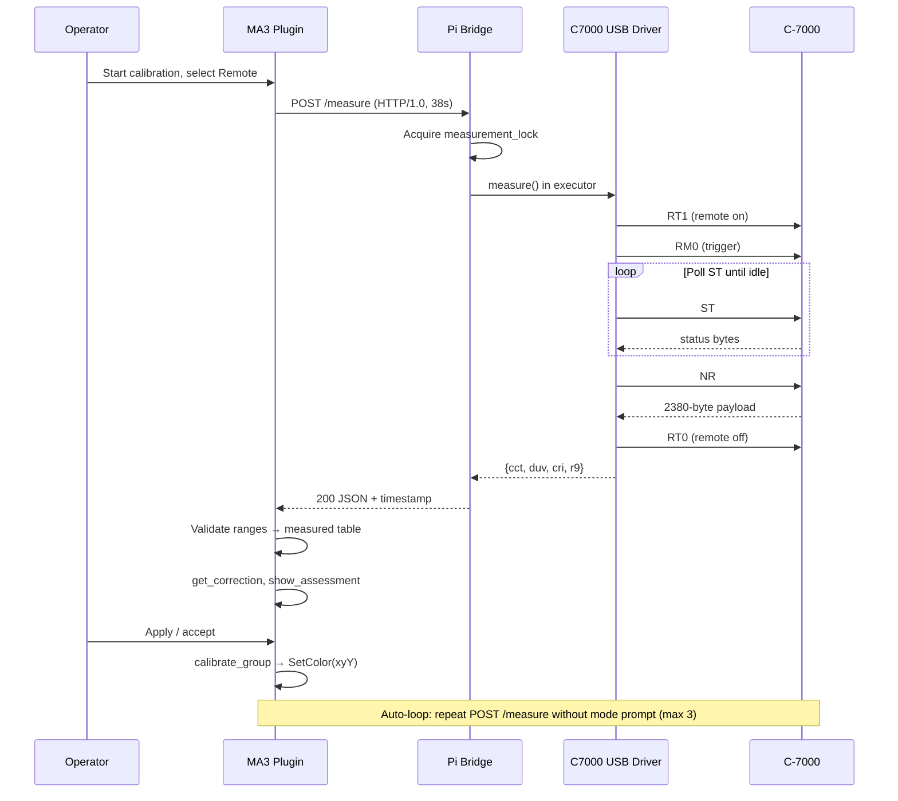
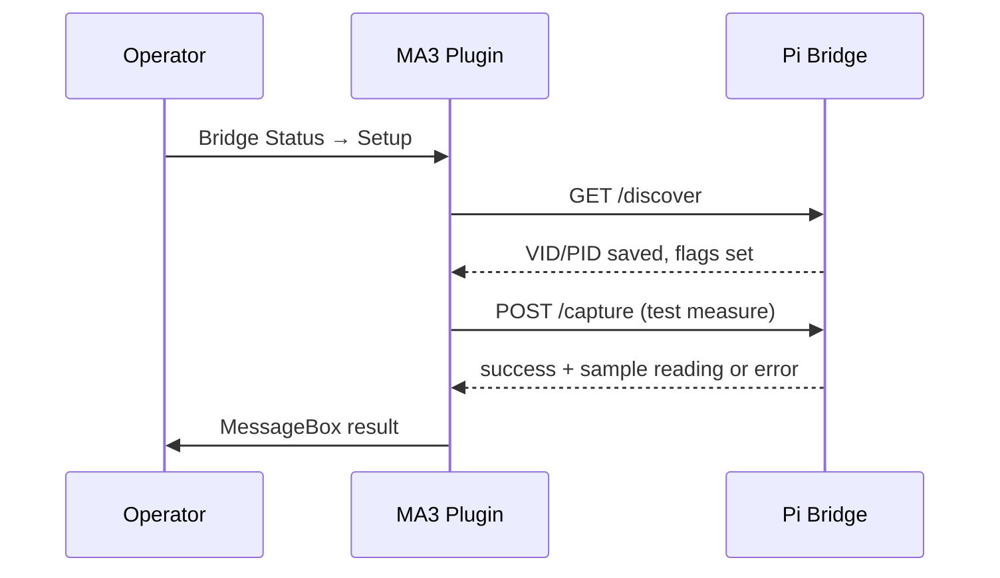

# Architecture Patterns

**Domain:** Dual-component color calibration — GrandMA3 Lua plugin + Raspberry Pi HTTP bridge  
**Project:** Lighttune v1 (clean architecture replan)  
**Researched:** 2026-07-01  
**Confidence:** HIGH (brownfield from v0.4/v0.5 experimental branches; MA3 multi-file `require` needs console verification — MEDIUM)

## Executive Recommendation

Lighttune v1 should be a **two-deployable-artifact system** with a **strict domain boundary** at the measurement record:

```text
{ cct, duv, cri, r9, tlci? }  ←  only cross-component contract
```

The Lua plugin owns **calibration orchestration, color math, MA3 fixture apply, and local fixture history**. The Pi bridge owns **USB meter I/O only** — no color math, no MA3 concepts, no fixture DB. The plugin entry file stays thin; shared pure logic moves into `require`-able modules tested once on the host. Bridge setup collapses for C-7000 to **discover + test measure**; legacy HID wizard paths are removed or gated.

---

## Target System Topology

### v1 — Pi bridge (production path)

```text
┌─────────────────────────────────────────────────────────────────────────────┐
│  FOH — GrandMA3 console (show VLAN, no HTTPS from Lua)                       │
│                                                                              │
│  plugin.xml → lua/main.lua                                                   │
│    ├─ color_math, fixture_db, goals          (pure / host-testable)          │
│    ├─ bridge_client                          (LuaSocket TCP HTTP/1.0)        │
│    ├─ ui, patch_api, fixture_apply           (MA3 API — console-only)        │
│    └─ calibration orchestrator               (session + auto-loop)           │
│                                                                              │
│  config.json: bridge_ip, bridge_port (8765), github_username                 │
│  data/fixture_log.json: append-only local DB                                 │
└───────────────────────────────┬─────────────────────────────────────────────┘
                                │
                    HTTP/1.0 over TCP (cleartext, trusted LAN)
                    GET  /status   (5 s timeout)
                    POST /measure  (38 s timeout)
                    GET  /discover, POST /capture  (setup only)
                                │
                                ▼
┌─────────────────────────────────────────────────────────────────────────────┐
│  Stage / subject position — Raspberry Pi (0.0.0.0:8765 or VLAN-bound IP)     │
│                                                                              │
│  sekonic-bridge/server.py (FastAPI + uvicorn, systemd)                       │
│    ├─ api/          routes + error mapping                                   │
│    ├─ meter/        MeterBackend protocol                                    │
│    │     ├─ c7000_bulk.py   (rename from meter_c7000_hid.py)                 │
│    │     └─ mock.py                                                          │
│    └─ device_config.json  (USB VID/PID persistence on Pi)                    │
└───────────────────────────────┬─────────────────────────────────────────────┘
                                │ USB bulk (pyusb)  RT1→RM0→ST→NR→RT0
                                ▼
                        [ Sekonic C-7000 ]
```

### Future — Direct device HTTP (out of v1 scope, topology option 2)

```text
┌──────────────┐         HTTP (if meter exposes REST)         ┌──────────────┐
│  GrandMA3    │ ─────────────────────────────────────────────► │  C-7000 or   │
│  plugin      │         same MeasurementRecord JSON shape      │  future meter│
└──────────────┘                                                └──────────────┘
```

**Design for swap:** `bridge_client.lua` becomes a **meter transport** interface. v1 implements `PiBridgeTransport` (host + port). A future `DirectMeterTransport` (device IP) reuses the same response parser and validation. Pi bridge remains required for C-7000 until Sekonic (or third party) documents on-device HTTP. Plugin config might evolve to `meter_transport: "pi_bridge" | "direct"` with mutually exclusive address fields.

**Network security unchanged:** MA3 cannot do HTTPS; direct-device path still assumes isolated show VLAN or a local TLS terminator outside the console.

---

## Plugin Module Split

### Problem (v0.5)

`lua/SekonicCalibrator.lua` is ~2,046 lines mixing color math, JSON DB, UI, patch API, HTTP client, and `main()`. `test_color_math.lua` duplicates ~240 lines — drift risk.

### Target layout

```text
[plugin-root]/
├── plugin.xml                    # ComponentLua → lua/main.lua
├── lua/
│   ├── main.lua                  # return main; wires menus + pcall entry
│   ├── constants.lua             # CCT_MIN, QUALITY, GOAL_*, meter types
│   ├── color_math.lua            # cct_to_xy, get_correction, gel_hint, …
│   ├── fixture_db.lua            # json_* helpers, recompute_best_flags, …
│   ├── goals.lua                 # goals_met, goal_status_str (pure)
│   ├── bridge_client.lua         # _http_request, bridge_fetch_measurement,
│   │                             # bridge_check_status, setup helpers
│   ├── config.lua                # load_config, get_plugin_dir, paths
│   ├── patch_api.lua             # get_fixture_from_patch, read_capabilities
│   ├── fixture_apply.lua         # calibrate_group, apply_color_hsb
│   ├── ui/
│   │   ├── dialogs.lua           # MessageBox wrappers, number input
│   │   ├── session.lua           # get_session_goals, get_spectral_goals
│   │   ├── measurement.lua       # get_measurement_params (remote + manual)
│   │   ├── assessment.lua        # show_assessment, show_result
│   │   └── history.lua           # show_fixture_history
│   └── calibration.lua           # outer/inner loops, auto-loop, session summary
├── data/
│   ├── config.json.example
│   └── fixture_log.json          # runtime
└── tests/
    ├── run.lua                   # host test runner entry
    ├── test_color_math.lua       # require("lua.color_math") — no duplication
    ├── test_fixture_db.lua
    ├── test_goals.lua
    └── test_bridge_parse.lua     # response validation only (no socket)
```

### Layer rules

| Layer | Modules | May call MA3 API? | Host-testable? |
|-------|---------|-------------------|----------------|
| **Domain** | `constants`, `color_math`, `fixture_db`, `goals` | No | Yes |
| **Transport** | `bridge_client` (parse/validate split from TCP) | `require("socket")` only | Partial (parse + goals) |
| **Integration** | `patch_api`, `fixture_apply` | Yes | No (console) |
| **Persistence** | `config` | `GetPath`, file I/O | Partial (path logic) |
| **Presentation** | `ui/*` | Yes (`MessageBox`) | No |
| **Application** | `calibration`, `main` | Yes | No |

### `require` packaging on GrandMA3

`plugin.xml` keeps a **single** `ComponentLua` entry (`lua/main.lua`). Sibling modules load via `require` if `package.path` includes the plugin `lua/` directory (standard MA3 plugin folder layout). **Verify on target console (v1.6.1.3)** before locking the split; fallback is `dofile(plugin_dir .. "/lua/color_math.lua")` from `main.lua` if `require` paths differ.

Each module returns a table (`return M`); no MA3 globals at module top level except in `main.lua` and `ui/*`.

### Dependency direction (enforced)

```text
main → calibration → ui, fixture_apply, bridge_client, config
calibration → goals, color_math, fixture_db, patch_api
bridge_client → constants (ranges only)
fixture_apply → color_math, patch_api
ui/measurement → bridge_client, config, fixture_db
```

**Forbidden:** `color_math` → `bridge_client`; `sekonic-bridge` → any Lua module.

### What moves out of the monolith first (merge order)

1. `color_math.lua` + `fixture_db.lua` — unblocks shared tests (126+ cases).
2. `goals.lua` — pure; needed for auto-loop tests.
3. `bridge_client.lua` — isolate HTTP + JSON parse from UI.
4. `config.lua` — fix `config.json` path (plugin root, not `data/` only).
5. Split `ui/*` and `calibration.lua` last (highest MA3 coupling).

---

## Bridge API Contract

### Transport

| Property | Value |
|----------|-------|
| Protocol | HTTP/1.0 over TCP |
| Default port | `8765` |
| TLS | None (v1) |
| Auth | None (v1); network isolation |
| Client | MA3 `require("socket").tcp()` — not `curl`, not `socket.http` |
| Concurrency | One `/measure` at a time (`409` if locked) |

### Shared types

**MeasurementRecord** (success body for `POST /measure`):

```json
{
  "cct": 5605,
  "duv": 0.0001,
  "cri": 94,
  "r9": 85,
  "tlci": 92,
  "timestamp": "2026-07-01T14:30:00Z"
}
```

| Field | Type | Required | Notes |
|-------|------|----------|-------|
| `cct` | int | yes | Kelvin; plugin clamps to `CCT_MIN`/`CCT_MAX` |
| `duv` | float | yes | Plugin clamps to `DUV_MIN`/`DUV_MAX` |
| `cri` | int | yes | 0–100 |
| `r9` | int | yes | 0–100 |
| `tlci` | int | no | Omitted on real C-7000 standard NR parse; mock may include |
| `timestamp` | string | yes | UTC ISO-8601 from bridge |

**Error body** (non-2xx, FastAPI `detail` object):

```json
{
  "error": "meter_not_connected",
  "hint": "human-readable operator hint"
}
```

Plugin maps `error` to MessageBox flows (retry / manual / cancel).

### Endpoints (v1 surface)

#### `GET /status`

| | |
|---|---|
| **Purpose** | Health check, setup flags, operator Bridge Status screen |
| **Timeout (plugin)** | 5 s |
| **200 body** | `{ status, meter, connected, uptime_s, last_error, version, device_configured, protocol_captured, trigger_discovered }` |

#### `POST /measure`

| | |
|---|---|
| **Purpose** | Trigger one spectrometer reading |
| **Timeout (plugin)** | 38 s (bridge internal 35 s) |
| **200 body** | MeasurementRecord |
| **503** | `meter_not_connected` |
| **409** | `measurement_in_progress` |
| **504** | `measurement_timeout` |
| **500** | `measurement_error` + `detail` |

#### `GET /discover`

| | |
|---|---|
| **Purpose** | USB scan; persist VID/PID to `device_config.json` |
| **C-7000** | VID `0x0A41`, PID `0x7003` → auto-set `protocol_captured`, `trigger_discovered` |
| **Mock** | Returns synthetic success without USB |

#### `POST /capture`

| | |
|---|---|
| **Purpose** | Verify meter responds (C-7000: run test `measure()`); passive listen only for unknown VID/PID |
| **v1 simplification** | C-7000 fast path only; drop HID passive capture from operator wizard |

#### `POST /learn_trigger` — **deprecated v1**

HID probe loop (~2 min) incompatible with C-7000 bulk protocol. Remove from operator wizard; keep internal only if unknown-meter research continues.

### Meter backend interface (Python)

All backends implement:

```python
class MeterBackend:
    def connect(self) -> bool: ...
    def is_connected(self) -> bool: ...
    def disconnect(self) -> None: ...
    def measure(self) -> dict:  # keys: cct, duv, cri, r9; optional tlci
```

Implementations: `C7000Bulk` (rename from `C7000HID`), `MockMeter`. Server holds singleton instance; reconnect on `/discover` after USB bump (v1 fix — today requires process restart).

### Versioning

Bridge `version` in `/status` and FastAPI app metadata. Plugin checks compatibility loosely (warn if major mismatch). Align `plugin.xml` Version with README (target `1.0.0` at v1 ship).

---

## MA3 → Pi → C-7000 Data Flow

### Sequence — remote measurement during calibration



### Sequence — bridge setup (v1 simplified)



### Plugin-internal pipeline (unchanged semantics from v0.4)

After `measured` is obtained (remote **or** manual):

1. `get_correction(goals.cct, goals.duv, measured.cct, measured.duv)` → target xy.
2. `show_assessment()` — quality ratings, gel hints, capability hints from patch.
3. `calibrate_group()` — `Cmd('Group "…"')`, `SetColor("xyY", …)` or HSB fallback.
4. `append_fixture_record()` → `fixture_log.json` with `recompute_best_flags()`.

**Known gap (must fix in v1 domain layer):** `get_correction` currently ignores measured xy for setpoint — auto-loop only automates **reading**, not closed-loop correction. Architecture should treat **correction algorithm** as domain logic in `color_math.lua`, independent of transport.

### Manual fallback (always available)

If `bridge_ip` unset, or operator chooses Manual, or bridge errors with Manual selected:

- Same pipeline from `get_correction` onward.
- No auto-loop (operator confirms each attempt via `ask_group_done()`).
- C-700/C-800: no TLCI prompt; C-7000: TLCI when tracked.

---

## Bridge Refactor (Python)

### Target layout

```text
sekonic-bridge/
├── server.py              # thin: argparse, uvicorn, app factory
├── api/
│   ├── routes.py          # FastAPI routes
│   └── schemas.py         # Pydantic MeasurementRecord, StatusResponse
├── meter/
│   ├── base.py            # MeterBackend protocol
│   ├── c7000_bulk.py      # USB bulk (skreader protocol)
│   └── mock.py
├── device_config.py       # load/save JSON
├── discover.py            # USB scan (shared by CLI + /discover)
├── discover_device.py     # CLI wrapper (optional thin)
├── tests/
│   ├── test_mock.py
│   ├── test_server.py     # httpx TestClient + --mock
│   └── fixtures/nr_2380.bin
└── requirements.txt
```

### Boundaries

| Inside bridge | Outside bridge |
|---------------|----------------|
| USB, asyncio lock, NR parse | Color math, Duv correction |
| `device_config.json` on Pi | `fixture_log.json` on console |
| Operator setup HTTP | MA3 `MessageBox` |

---

## Build Order (Implementation Phases)

Recommended dependency order for the clean-architecture milestone:

| Phase | Deliverable | Depends on | Validates |
|-------|-------------|------------|-----------|
| **1** | Repo canonical branch + folder layout | — | Single source tree (merge experimental) |
| **2** | `color_math.lua`, `fixture_db.lua`, `goals.lua` + host `tests/` | Phase 1 | 126+ math tests via `require`, no duplication |
| **3** | `config.lua` path fix + `plugin.xml` version | Phase 2 | `bridge_ip` loads from plugin root |
| **4** | `bridge_client.lua` extract + `test_bridge_parse.lua` | Phase 3 | Parse/validate without MA3 |
| **5** | Bridge rename `c7000_bulk`, drop HID wizard from API surface | Phase 1 | Mock server tests |
| **6** | `ui/*`, `calibration.lua`, thin `main.lua` | Phases 2–4 | Console smoke test |
| **7** | Pi image/systemd + docs aligned to TCP client | Phase 5–6 | E2E mock then hardware |
| **8** | Closed-loop `get_correction` fix (domain) | Phase 2 | Meaningful auto-loop |

**Parallelizable:** Phase 5 (Python) alongside Phase 2–4 (Lua domain/transport). **Gate before ship:** Phase 7 E2E on real MA3 + Pi + C-7000.

**Do not build first:** HTTPS, auth, direct-device transport, community auto-upload, `/learn_trigger` operator UI.

---

## Test Boundaries

### Principle: test at the seam

```text
┌─────────────────────────────────────────────────────────────────┐
│  Host (lua5.4 / pytest) — CI target                              │
│  ✓ color_math, fixture_db, goals                                 │
│  ✓ bridge JSON parse + range validation (no TCP)                 │
│  ✓ meter_mock progression, server routes (TestClient)            │
│  ✓ c7000_bulk._parse() golden NR fixture                         │
├─────────────────────────────────────────────────────────────────┤
│  Integration (dev LAN) — manual or scripted curl                 │
│  ✓ POST /measure against server.py --mock                        │
│  ✓ Plugin config → mock bridge IP (needs MA3 for full UI)        │
├─────────────────────────────────────────────────────────────────┤
│  Console-only — physical MA3 + showfile                          │
│  ✓ require("socket"), MessageBox flows, SetColor, DataPool      │
│  ✓ Auto-loop UX, bridge error dialogs                            │
├─────────────────────────────────────────────────────────────────┤
│  Hardware — Pi + C-7000                                          │
│  ✓ USB connect, measure latency, unplug recovery                 │
└─────────────────────────────────────────────────────────────────┘
```

### Module ↔ test mapping

| Module | Test file | Runner | Notes |
|--------|-----------|--------|-------|
| `color_math.lua` | `tests/test_color_math.lua` | `lua5.4 tests/run.lua` | Replace inline duplication |
| `fixture_db.lua` | `tests/test_fixture_db.lua` | same | Deterministic dates |
| `goals.lua` | `tests/test_goals.lua` | same | Include TLCI-absent cases |
| `bridge_client.lua` (parse only) | `tests/test_bridge_parse.lua` | same | Sample JSON bodies, error extraction |
| `bridge_client.lua` (TCP) | — | MA3 or mock LAN | No host socket to Pi in CI unless service container |
| `patch_api`, `fixture_apply`, `ui/*` | — | Console | Stub MA3 globals later if harness added |
| `meter/mock.py` | `tests/test_mock.py` | pytest | Progression table contract |
| `api/routes.py` | `tests/test_server.py` | pytest + httpx | 409, 503, 504 shapes |
| `meter/c7000_bulk.py` | `tests/test_parse_nr.py` | pytest | Golden 2380-byte file |

### Mock vs real parity rules

| Behavior | MockMeter | C7000Bulk | Test requirement |
|----------|-----------|-----------|------------------|
| TLCI field | Present | Absent (standard mode) | `goals_met` tests for both |
| Setup flags | All true | From `device_config.json` | Status endpoint tests |
| Progression | Improving series | Single shot | Auto-loop dev vs prod docs |

Add `--mock-realistic` flag: omit TLCI, match production schema.

### CI recommendation

```yaml
# .github/workflows/test.yml (not present today)
- lua5.4 tests/run.lua
- cd sekonic-bridge && pytest
```

No MA3 runner in CI; gate releases with a manual **console checklist** document.

### Anti-patterns (testing)

| Anti-pattern | Instead |
|--------------|---------|
| Duplicate Section 2 in `test_color_math.lua` | `require("lua.color_math")` |
| Test USB in unit CI | Golden NR bytes + manual Pi job |
| Assert full plugin via `require("SekonicCalibrator")` | Thin `main.lua`; test domain modules |
| Rely on mock TLCI for production sign-off | Hardware checklist without TLCI goal or FW>25 mode |

---

## Component Boundary Summary

| Boundary | Owner | Contract |
|----------|-------|----------|
| Spectrometer reading | Pi bridge | MeasurementRecord JSON over HTTP |
| Calibration decision | Lua plugin | `measured` + `goals` → correction → SetColor |
| Fixture history | Lua plugin | `fixture_log.json` schema (Section 2b) |
| USB identity | Pi bridge | `device_config.json` |
| Operator config | Lua plugin | `config.json` at plugin root |
| MA3 patch capabilities | Lua plugin | Patch API only — no GDTF files |

---

## Anti-Patterns to Avoid

### Monolithic return-to-main plugin file

**What:** Single 2k-line `SekonicCalibrator.lua` with `return main`.  
**Why bad:** Untestable drift; bridge changes touch color math.  
**Instead:** Thin `main.lua` + domain modules.

### Bridge knows calibration

**What:** Pi computes Duv targets or stores fixture_log.  
**Why bad:** Two sources of truth; console offline still needs plugin DB.  
**Instead:** Bridge returns raw meter fields only.

### HID wizard on C-7000 bulk path

**What:** `/learn_trigger` in operator setup.  
**Why bad:** 2-minute irrelevant probes; wrong protocol family.  
**Instead:** Discover + test measure for VID `0x0A41`.

### Regex JSON as integration contract

**What:** Ad-hoc `body:match('"cct"%s*:…')` without tests.  
**Why bad:** Breaks on key order, nested objects, escaped strings.  
**Instead:** Central `parse_measurement_json(body)` in `bridge_client.lua` with host tests; tighten bridge to stable key order in docs.

---

## Scalability Considerations

| Concern | v1 (1 show) | Multiple stations | Future |
|---------|-------------|-------------------|--------|
| Bridge instances | 1 Pi, 1 meter | 1 Pi per measurement position | Direct HTTP per meter |
| `/measure` lock | Single operator | Document one client per Pi | Queue or 409 (unchanged) |
| `fixture_log.json` | Full rewrite per append | Cap history per fixture | Optional SQLite export |
| MA3 UI | Modal, blocking | Batch mode deferred | Saved session defaults |

---

## Sources

- `.planning/PROJECT.md` — v1 scope, topology decision, constraints
- `.planning/codebase/ARCHITECTURE.md` — v0.4/v0.5 brownfield flows
- `.planning/codebase/STRUCTURE.md` — section map, sekonic-bridge layout
- `.planning/codebase/CONCERNS.md` — monolith, HID naming, test gaps, `get_correction` bug
- `.planning/codebase/INTEGRATIONS.md` — HTTP API fields, USB protocol
- `.planning/codebase/TESTING.md` — duplicate-test pattern, mock progression
- `origin/Lighttune-experimental` — `server.py`, `SekonicCalibrator.lua` Section 2c (git show)

---

*Architecture research: 2026-07-01 — Lighttune v1 clean replan*
