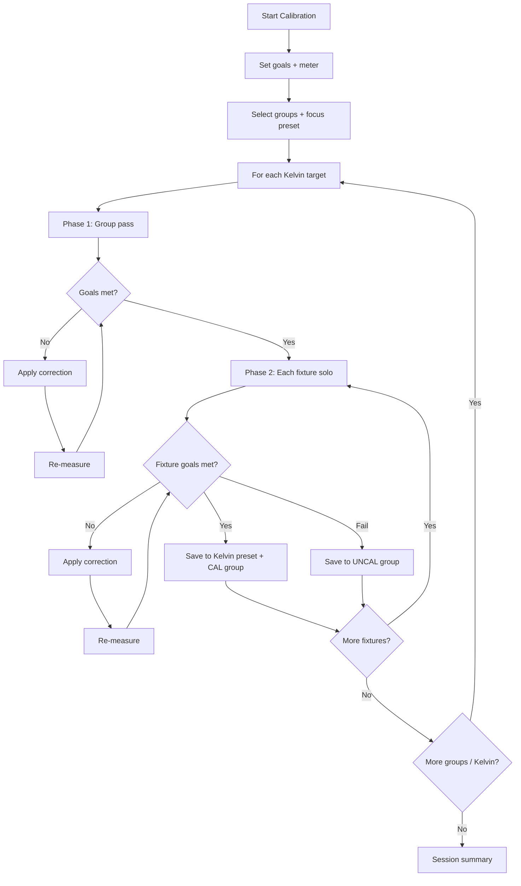

# Lighttune — SekonicCalibrator v1.0

Calibrate fixture groups on **GrandMA3** using a **Sekonic C-700, C-800, or C-7000**.
Built for TV and broadcast work where CCT, Duv, CRI, R9, and TLCI need to match across a rig.

---

## What you get

- **Two-phase calibration** — whole group first, then each fixture solo
- **Automatic corrections** — RGB xy, Tint, CTO/CTB, and color-wheel slots when the fixture supports them
- **Incremental Kelvin presets** — each passing fixture merges into a shared `5600K`-style color preset
- **CAL / UNCAL groups** — fixtures sorted into calibrated vs not-calibrated groups
- **C-7000 auto-loop** — bridge triggers the meter and auto-applies corrections (no Apply button each pass)
- **Local history** — every session saved to `data/fixture_log.json`

---

## Requirements

| Item | Notes |
|------|--------|
| GrandMA3 | onPC or console, v1.6+ recommended |
| Sekonic meter | C-700, C-800, or C-7000 |
| Fixture groups | Patched and grouped in your showfile |
| Bridge (optional) | For C-7000 remote measure + hands-free loop. Same Mac as onPC, or a Pi on LAN |

---

## Installation

### Step 1 — Get the plugin files

**Option A — from this repo (recommended):**

```bash
git clone https://github.com/jrikner/Lighttune.git
cd Lighttune
git checkout lighttune-1.0
./package-plugin.sh --install
```

This builds `dist/SekonicCalibrator/` and copies it to your GM3 plugin library.

**Option B — manual copy:**

```bash
./package-plugin.sh          # builds dist/SekonicCalibrator/
./package-plugin.sh --zip    # optional: dist/SekonicCalibrator.zip
```

Copy the **`SekonicCalibrator`** folder (keep that exact name) to:

| OS | Path |
|----|------|
| macOS / Linux | `~/MALightingTechnology/gma3_library/datapools/plugins/SekonicCalibrator/` |
| Windows | `C:\ProgramData\MALightingTechnology\gma3_library\datapools\plugins\SekonicCalibrator\` |

### Step 2 — Import in GrandMA3

1. Open your showfile
2. **Menu → Plugin Pool → Import → SekonicCalibrator**
3. Assign the plugin to a macro key or executor
4. Double-tap to run

Re-run `./package-plugin.sh --install` any time you update — it overwrites code but **never touches** your `config.json` or saved measurement data.

### Step 3 — Plugin config (optional)

```bash
cp dist/SekonicCalibrator/data/config.json.example \
   ~/MALightingTechnology/gma3_library/datapools/plugins/SekonicCalibrator/config.json
```

Edit `config.json` at the **plugin root** (same folder as `plugin.xml`):

```json
{
  "github_username": "your_name",
  "bridge_ip":       "127.0.0.1",
  "bridge_port":     8765,
  "focus_preset":    "2.12"
}
```

| Field | Purpose |
|-------|---------|
| `bridge_ip` | `127.0.0.1` = bridge on same Mac as onPC. Or Pi IP on LAN |
| `bridge_port` | Default `8765` |
| `focus_preset` | Position preset (pool 2) with fixtures aimed at the Sekonic. Skips the session prompt if set |
| `bridge_api_key` | Optional shared secret if the bridge requires auth |

### Step 4 — Bridge setup (C-7000 remote measure only)

**Same Mac as onPC (easiest):**

```bash
cd sekonic-bridge
./setup-mac.sh
```

Plug the C-7000 in via USB. Open the dashboard: **http://127.0.0.1:8765/dashboard**

Set `"bridge_ip": "127.0.0.1"` in plugin `config.json`.

**Pi on stage (console and meter on different machines):**

See [`sekonic-bridge/README.md`](sekonic-bridge/README.md) for Pi deployment.

---

## Before your first calibration

Do this once per show (or per rig setup):

### 1. Create a focus position preset

1. Select all fixtures you will calibrate
2. Point pan/tilt (and XYZ if needed) at the Sekonic meter position
3. **Store Preset 2.x** (Position pool) — e.g. Preset `2.12` named `"Sekonic focus"`

The plugin applies **position only** from this preset before each measurement. Dimmer and color are handled by the plugin.

### 2. Create your calibration groups

- One GM3 **group** per batch you want to calibrate together (e.g. `Front Wash`, group `3`)
- Fixtures must be patched with correct fixture types (GDTF) so the plugin can detect Tint, CTO, CTB, etc.

### 3. Full intensity at the meter

During calibration the plugin automatically:

- **Solos** the target (group or single fixture)
- Sets **dimmer to 100%**
- Enables **all color attributes** on the fixture
- Applies your **focus position preset**

---

## How to use — step-by-step workflow

### Session start

| Step | What happens |
|------|----------------|
| **1** | Run the plugin → **Start Calibration** |
| **2** | Choose meter: **C-700/C-800** or **C-7000** |
| **3** | Set goals: target Kelvin(s), Duv, CRI / R9 / TLCI minimums |
| **4** | Bridge preflight (C-7000 only) — confirms bridge is reachable |
| **5** | Enter fixture group(s) — one at a time or comma-separated (`1, 3, Front Wash`) |
| **6** | Enter **focus position preset** — e.g. `2.12` or `12` (skipped if set in `config.json`) |

### Per group, per Kelvin target

For each group at each Kelvin target (e.g. 3200K then 5600K):

#### Phase 1 — Group pass

```
Whole group selected → solo → focus preset → dimmer 100% → measure → correct → repeat
```

- First measurement: enter Sekonic values manually, or **Remote** if bridge is active
- **Manual mode:** Assessment dialog → **Apply** or **Skip** each correction
- **Bridge mode (C-7000):** corrections auto-apply, no Apply button; loops until goals met
- When goals are met (or limit reached): color merges into Kelvin preset; group pass ends

#### Phase 2 — Individual fixtures

```
For each fixture in the group:
  solo one fixture → focus preset → dimmer 100% → measure → correct → repeat
  on pass → merge into Kelvin preset + add to CAL group
  on fail → add to UNCAL group
```

- Same manual vs bridge behaviour as Phase 1
- Each fixture gets its own correction (units drift differently)

### Session end

- **Session summary** lists every group, readings, and pass/fail
- Data saved to `data/fixture_log.json`
- View history anytime: plugin menu → **View Fixture History**

---

## Workflow diagram



---

## Taking Sekonic readings

1. Meter in **Incident** mode, dome up
2. Dome toward the light source, at the subject position
3. Press **Measure** on the meter
4. Enter in the plugin (or use **Remote** with C-7000 + bridge):

| Reading | On meter | Meaning |
|---------|----------|---------|
| **CCT** | Main display | Colour temperature (Kelvin) |
| **Duv (Δuv)** | Deviation field | Green (+) / magenta (−) vs neutral locus |
| **CRI Ra** | CRI screen | General colour rendering |
| **R9** | CRI → R1–R15 | Deep red (skin tones, costumes) |
| **TLCI** | TLCI screen | Broadcast camera index (C-7000 only) |

---

## What the plugin saves

| Output | Where | When |
|--------|-------|------|
| **Kelvin color preset** | Preset pool 4 — e.g. `4.5 "5600K"` | First pass creates; each fixture merges |
| **CAL group** | Group pool | Fixtures that met goals |
| **UNCAL group** | Group pool | Fixtures that did not |
| **Measurement log** | `data/fixture_log.json` | After each group completes |

---

## Color math — what's proven vs practical

The plugin uses **standard colorimetry** for geometry and **closed-loop feedback** for corrections. Some tuning constants are engineering choices, not physics laws.

### Standard (published / tested)

| Piece | Basis |
|-------|--------|
| **CCT → xy** | Kang et al. (2002) — Planckian locus polynomials, 1667–25000 K |
| **xy ↔ u′v′** | CIE 1960/1976 transforms |
| **Duv** | Same family as Sekonic: distance from the locus in u′v′ (green/magenta) |
| **xy → RGB → HSB** | sRGB matrix + standard HSB (for GM3 `SetColor` fallback) |
| **Closed-loop correction** | Error feedback in u′v′: `next_command = last_command + (target − measured)` |

Unit tests in `tests/test_color_math.lua` verify Kang reference values, u′v′ roundtrips, and correction direction.

### Practical approximations (tuned for desk workflow)

| Piece | Notes |
|-------|--------|
| **Duv → xy shift** | `Δv′ = ΔDuv × 1.5` — scaling heuristic |
| **Sekonic CCT → Kang xy** | Meter and plugin use different CCT algorithms; closed-loop compensates |
| **Tint / CTO / CTB gains** | Fixed step sizes per Kelvin and Duv error — fixture-dependent |
| **GAIN = 1.0** | Full proportional step; may overshoot on nonlinear fixtures |

### What gets applied each correction

1. **Tint** — Duv error (if fixture has Tint channel)
2. **CTO / CTB** — CCT error (warmer / cooler)
3. **Color wheel slot** — if no dedicated Tint/CTO/CTB (matched by slot name from GDTF)
4. **SetColor xyY** — fine RGB mix adjustment (falls back to HSB)

All color attributes are activated before store, so the full color state merges into the Kelvin preset.

---

## Bridge & web dashboard

When the bridge is running:

| URL | Purpose |
|-----|---------|
| `http://127.0.0.1:8765/dashboard` | Live status, meter model, reconnect |
| `http://127.0.0.1:8765/status` | JSON health check |
| `POST /measure` | Trigger a reading (used by the plugin) |

**Bridge mode behaviour:**

- Auto-measures after each apply (no manual entry unless bridge drops)
- Auto-applies corrections (no Assessment Apply/Skip)
- Still shows save review when a fixture passes or fails

---

## Calibration modes

### Calibrate to target (default)

Set fixed Kelvin target(s) — e.g. `5600K` — and optional Duv (default `0.000` neutral). Every group and fixture is corrected to that target.

### Match to reference group

Measure a reference group first (e.g. existing HMIs). All other groups are matched to that group's CCT and Duv.

---

## Supported meters

| Model | CCT | Duv | CRI | R9 | TLCI | Bridge auto-loop |
|-------|-----|-----|-----|----|------|------------------|
| C-700 | ✓ | ✓ | ✓ | ✓ | — | Manual entry only |
| C-800 | ✓ | ✓ | ✓ | ✓ | — | Manual entry only |
| C-7000 | ✓ | ✓ | ✓ | ✓ | ✓ | ✓ with bridge |

---

## Troubleshooting

| Problem | Fix |
|---------|-----|
| Plugin won't import | Folder must be named exactly `SekonicCalibrator`; `SekonicCalibrator.lua` must sit beside `plugin.xml` |
| Phase 2 skipped | Plugin couldn't read fixture list — re-select group in Patch; check group has members |
| Bridge unavailable | Run `./setup-mac.sh`; check `http://127.0.0.1:8765/status`; verify `bridge_ip` in config |
| Wrong fixture type | Group must be selected before lookup; check patch/fixture type in MA3 |
| Preset empty after save | Ensure color attributes are on fixture type; check Preset pool 4 |
| `require("goals")` crash | Re-import plugin — domain modules load from `lua/` via `loadfile`, not GM3 cache |

---

## Running tests

```bash
# Lua (color math, goals, mock sequences)
lua5.4 tests/run.lua

# Python (bridge API, dashboard, C-7000 driver)
python3 -m venv .venv
.venv/bin/pip install -r sekonic-bridge/requirements.txt -r sekonic-bridge/requirements-dev.txt
.venv/bin/pytest tests -v
```

---

## Project layout

```
Lighttune/
├── SekonicCalibrator.lua    # GM3 plugin entry point
├── plugin.xml
├── lua/                     # Domain modules (color math, goals, bridge client, fixture DB)
├── data/                    # config example + fixture_log.json at runtime
├── sekonic-bridge/          # HTTP bridge + web dashboard (server.py)
├── package-plugin.sh        # Build + install to GM3 library
└── tests/                   # Lua + Python test suites
```

---

## License

MIT — part of the [Lighttune](https://github.com/jrikner/Lighttune) project.

**Branch:** `lighttune-1.0`
